## Welcome to my GitHub profile! 

Hi 👋, I'm a Software Engineer based in  **Portugal**.

🎓 I hold a Bachelor's degree in Computer Science and am currently pursuing a major in the same field.

### Main Projects

- 🤖 **[discord.js](https://github.com/discordjs/discord.js)** - A powerful JavaScript library for interacting with the Discord API
- 📝 **[discord-api-types](https://github.com/discordjs/discord-api-types)** - Up to date Discord API typings, versioned by the API version
- 👀 **[Lurkr](https://lurkr.gg)** - A Discord bot with focus on automation, leveling, emoji management, and image manipulation

### Side Projects

- 🔨 **[discord-ban-sync](https://github.com/almeidx/discord-ban-sync)** - Sync bans across multiple Discord servers
- 🔄 **[versi](https://github.com/almeidx/versi)** - A native GUI application for managing Node.js versions
- 💻 **[repl](https://github.com/almeidx/repl)** - A browser-based TypeScript/JavaScript REPL powered by WebContainers
- 🔍 **[diff](https://github.com/almeidx/diff)** - Compare versions of npm packages and WordPress plugins with a visual diff viewer
- 🧩 **[serialize](https://github.com/almeidx/serialize)** - A client-side tool for parsing, editing, and converting PHP serialized data
